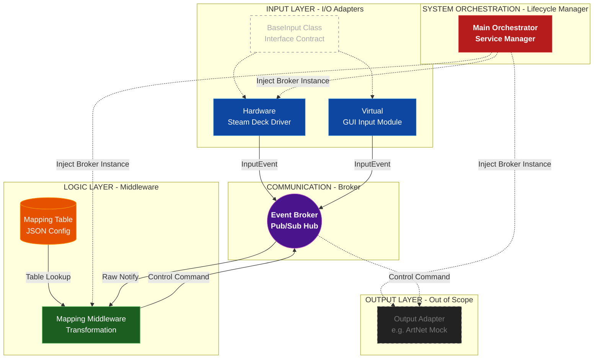

# Apelios Architecture Blueprint
**Version:** 1.2  
**Status:** Active Source of Truth  
**Architecture Style:** Micro-Kernel / Decoupled Event-Driven Pipeline

## 1. System Vision
This project utilizes a **Micro-Kernel Architecture** centered on a **Decoupled Event-Driven Pipeline**. The **Main Orchestrator** manages the system lifecycle and implements **Dependency Injection** to provide a shared **Event Broker** instance to all modules.

Input Modules (Hardware/Virtual) act as adapters that capture raw signals and publish them as **Normalized Input Events** (0.0 ... 1.0) to the broker. The **Mapping Middleware** subscribes to these events, performing **Data Transformation** (sensitivity, inversion, and remapping) based on a dynamic **JSON Mapping Table**.

Once processed, the broker **dispatches** the resulting **Control Commands** to the **Output Layer**, ensuring a clear **Separation of Concerns** between hardware interaction and domain logic.

---

## 2. Structural Diagram

---

## 3. Layer Definitions

### A. System Orchestration (Lifecycle Manager)
* **Main Orchestrator:** The micro-kernel of the application. It is responsible for booting the network server, instantiating the Event Broker client, and injecting that shared client into the Input, Logic, and Output layers.

### B. Communication (Event Broker)
* **Pub/Sub Hub:** The absolute center of the data pipeline. Modules never talk to each other directly; they only communicate via Pub/Sub topics on the broker (e.g., NATS).

### C. Input Layer (I/O Adapters)
* **Responsibility:** Capture hardware/virtual inputs, normalize them to a standard scale (0.0 to 1.0) or standard delta/rate intents, and publish them.
* **Interface Contract:** All inputs must inherit from `BaseInput` to ensure they expose standard startup/shutdown and publishing methods.

#### Input Event Contract (Current)
* **Payload:** `{"source": str, "value": float}`
* **Type Resolution:** Input intent (`absolute`, `delta`, `rate`) is resolved in the Middleware from the mapping profile, not carried in adapter payloads.
* **Timing Model:** Frame `dt` is provided by the Main Orchestrator heartbeat (`tick` loop), not derived from event timestamps.

### D. Logic Layer (Middleware)
* **Mapping Middleware:** Subscribes to raw inputs. Uses the `process_frame()` loop to accumulate deltas, apply rates over time, and calculate final target states.
* **JSON Mapping Table:** An injected configuration file that dictates which input maps to which output, alongside settings like sensitivity and merge strategies.

### E. Output Layer (Out of Scope)
* **Responsibility:** Subscribes to the final `Control Commands` from the Broker and translates them into physical protocols (like ArtNet/DMX). 

---

## 4. Key Architectural Decisions (ADRs)
