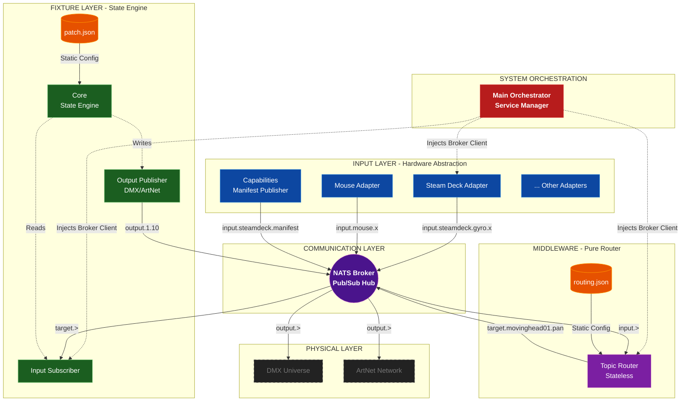

# Apelios Architecture Blueprint
**Version:** 2.0  
**Status:** Target Architecture (Migration in Progress)  
**Last Updated:** 2026-06-03  
**Architecture Style:** Micro-Kernel / Decoupled Event-Driven Pipeline

> **⚠️ NOTE:** This document describes the **TARGET** architecture. The current implementation has drifted from this design. See [architecture-changes.md](./architecture-changes.md) for the migration plan.

---

## 1. System Vision

Apelios is a **Micro-Kernel Architecture** centered on a **Decoupled Event-Driven Pipeline** with a central NATS broker. Data flows in a strictly **unidirectional** path:

**Hardware → Input Layer → Middleware → Fixture Layer → Lights**

Each layer has a single responsibility and communicates exclusively via NATS topics using a **standardized JSON payload schema**. Layers have **zero direct code dependencies** on each other.

The **Main Orchestrator** manages the system lifecycle and injects a shared **Broker Client** instance into each layer's Runtime Manager.

---

## 2. Structural Diagram


```mermaid
graph TD
    %% Define Styles
    classDef orch fill:#b71c1c,stroke:#d32f2f,color:#fff,font-weight:bold;
    classDef input fill:#0d47a1,stroke:#1976d2,color:#fff;
    classDef broker fill:#4a148c,stroke:#ab47bc,color:#fff,font-weight:bold;
    classDef middleware fill:#7b1fa2,stroke:#9c27b0,color:#fff;
    classDef fixture fill:#1b5e20,stroke:#66bb6a,color:#fff;
    classDef config fill:#e65100,stroke:#ff9800,color:#fff;
    classDef output fill:#222,stroke:#444,color:#777,stroke-dasharray: 5 5;

    subgraph ORCH[SYSTEM ORCHESTRATION]
        Orch[Main Orchestrator\nService Manager]:::orch
    end

    subgraph BROKER[COMMUNICATION LAYER]
        Broker((NATS Broker\nPub/Sub Hub)):::broker
    end

    subgraph INPUT[INPUT LAYER - Hardware Abstraction]
        Manifest[Capabilities\nManifest Publisher]:::input
        Input1[Steam Deck Adapter]:::input
        Input2[Mouse Adapter]:::input
        Input3[... Other Adapters]:::input
    end

    subgraph MW[MIDDLEWARE - Pure Router]
        Router[Topic Router\nStateless]:::middleware
        RoutingConfig[(routing.json)]:::config
    end

    subgraph FIX[FIXTURE LAYER - State Engine]
        FixtureInput[Input Subscriber]:::fixture
        FixtureCore[Core\nState Engine]:::fixture
        FixtureOutput[Output Publisher\nDMX/ArtNet]:::fixture
        PatchConfig[(patch.json)]:::config
    end

    subgraph LIGHTS[PHYSICAL LAYER]
        DMX[DMX Universe]:::output
        ArtNet[ArtNet Network]:::output
    end

    %% Lifecycle Management
    Orch -.->|Injects Broker Client| Input1
    Orch -.->|Injects Broker Client| Router
    Orch -.->|Injects Broker Client| FixtureInput

    %% Data Flow
    Input1 -- input.steamdeck.gyro.x --> Broker
    Input2 -- input.mouse.x --> Broker
    Manifest -- input.steamdeck.manifest --> Broker
    
    Broker -- input.> --> Router
    RoutingConfig -- Static Config --> Router
    
    Router -- target.movinghead01.pan --> Broker
    Broker -- target.> --> FixtureInput
    
    FixtureCore -.->|Reads| FixtureInput
    FixtureCore -.->|Writes| FixtureOutput
    PatchConfig -- Static Config --> FixtureCore
    
    FixtureOutput -- output.1.10 --> Broker
    Broker -- output.> --> DMX
    Broker -- output.> --> ArtNet
```

---

## 3. Standardized Payload Schema

**ALL** messages between layers use this schema:

```json
{
  "value": 0.05,
  "type": "delta",
  "timestamp": 1685363400.123
}
```

### Valid Types
| Type | Description | Range | Example Use |
|------|-------------|-------|-------------|
| `absolute_uni` | Unipolar absolute | 0.0 to 1.0 | Faders, buttons |
| `absolute_bi` | Bipolar absolute | -1.0 to 1.0 | Joystick axes |
| `delta` | Relative change | Unbounded | Mouse movement |
| `rate` | Velocity | Unbounded | Gyroscope, rate-based control |

> **⚠️ MIGRATION NOTE:** Current implementation uses `intent` instead of `type` in Fixture Layer. Middleware currently adds `intent` from mapping config. Target: Input Layer publishes `type`, Middleware passes it through unchanged.

---

## 4. Layer Definitions

### A. System Orchestration (Lifecycle Manager)

**Main Orchestrator:** The micro-kernel of the application.
- Boots the NATS server
- Instantiates Broker Client instances
- Injects clients into layer Runtime Managers
- Manages the 60Hz tick loop
- Coordinates startup/shutdown order

### B. Communication Layer (Event Broker)

**NATS Broker:** The absolute center of the data pipeline.
- All inter-layer communication happens via NATS topics
- Modules never talk to each other directly
- Supports distributed deployment across multiple machines

#### Topic Space
| Layer | Publishes To | Subscribes To | Payload |
|-------|--------------|---------------|---------|
| Input | `input.<device>.<axis>` | - | `{value, type, timestamp}` |
| Input | `input.<device>.manifest` | - | Capabilities manifest |
| Middleware | `target.<fixture>.<param>` | `input.>` | `{value, type, timestamp}` (unchanged) |
| Fixture | `output.<universe>.<address>` | `target.>` | `{value, type, timestamp}` processed |

### C. Input Layer (Hardware Abstraction Layer - HAL)

**Role:** Read messy physical hardware, compensate for physical flaws, normalize to mathematical floats, and publish with intent.

#### Responsibilities
- **Hardware Abstraction:** Support multiple input devices (Steam Deck, Mouse, MIDI, etc.)
- **Hardware Compensation:** Apply deadzones, jitter filtering, sensitivity curves
- **Normalization:** Convert raw hardware values to standardized floats
- **Intent Tagging:** Determine and publish the `type` for each axis (absolute_uni, absolute_bi, delta, rate)
- **Capabilities Manifest:** Publish available axes and their properties on startup

#### Components
1. **Input Runtime Manager:** Lifecycle, broker connectivity, adapter management
2. **Input Publisher:** Publish normalized events with type to `input.<device>.<axis>`
3. **Base Input Adapter:** Interface contract for all adapters
4. **Device Adapters:** Steam Deck, Mouse, Fake, etc.

#### Input Event Contract (TARGET)
```json
{
  "value": 0.5,
  "type": "delta",
  "timestamp": 1685363400.123
}
```

> **⚠️ CURRENT:** `{"source": "steamdeck.axis", "value": 0.5}` - Missing `type` and `timestamp`

### D. Middleware (Pure Router)

**Role:** A **stateless** switchboard that maps input topics to target topics.

#### Responsibilities
- **Topic Routing:** Map `input.<device>.<axis>` to `target.<fixture>.<parameter>`
- **Capabilities Buffer:** Store input manifests in RAM for validation
- **NO Math:** Must NOT perform any transformations, calculations, or compensations
- **NO State:** Must NOT store any positional or historical data
- **Passthrough:** Republish identical payload (including `type`) to target topic

#### Components
1. **Middleware Runtime Manager:** Lifecycle, broker connectivity
2. **Middleware Input Subscriber:** Receive from `input.>` topics
3. **Topic Router:** Lookup routing table, forward messages
4. **Middleware Output Publisher:** Publish to `target.>` topics

#### Routing Configuration
```json
{
  "mappings": {
    "input.steamdeck.right_stick.x": "target.movinghead01.pan",
    "input.steamdeck.imu.yaw": "target.movinghead01.pan"
  }
}
```

> **⚠️ CURRENT:** Mapping files include `intent` and `sensitivity` fields. Target: Only source→target mapping.

### E. Fixture Layer (State Engine)

**Role:** Maintain the absolute truth of the physical lighting rig. Handle all mathematical integrations, clamping, and protocol output.

#### Responsibilities
- **State Management:** Maintain absolute position for all patched parameters
- **Mathematical Integration:** Apply delta/rate math based on incoming `type`
- **Clamping:** Enforce physical limits after calculations
- **Protocol Translation:** Convert normalized state to DMX/ArtNet values

#### Components
1. **Fixture Runtime Manager:** Lifecycle, broker connectivity, 60Hz loop
2. **Fixture Input Subscriber:** Subscribe to `target.>` topics, populate inbox
3. **Fixture Core:** State engine, math processing, clamping
4. **Fixture Output Publisher:** Publish DMX values to `output.>` topics

#### Configuration (patch.json)
```json
{
  "fixtures": {
    "movinghead01": {
      "type": "robe_robospot",
      "universe": 2,
      "address": 10,
      "parameters": {
        "pan": { "limits": [0.0, 1.0], "width": 16 },
        "tilt": { "limits": [0.0, 1.0], "width": 16 }
      }
    }
  }
}
```

#### Mathematical Operations (by type)
Let $S_{old}$ = current state, $V_{in}$ = incoming value, $L_{min}, L_{max}$ = parameter limits, $\Delta t$ = frame time.

| Type | Formula | Clamping |
|------|---------|----------|
| `absolute_uni` / `absolute_bi` | $S_{new} = V_{in}$ | After assignment |
| `delta` | $S_{new} = S_{old} + V_{in}$ | After addition |
| `rate` | $S_{new} = S_{old} + (V_{in} \times \Delta t)$ | After integration |

### F. Output Layer (Protocol Adapters)

**Role:** Translate Fixture Layer output to physical protocols.

- **DMX:** 8-bit (0-255) and 16-bit (0-65535) support
- **ArtNet:** Network-based DMX distribution
- **sACN:** Ethernet lighting protocol
- **NATS Out:** For distributed systems

---

## 5. Current Architecture Drift

The current implementation (as of commit 60da486) has the following **violations** of the target architecture:

### 🚨 Critical Violations

| Violation | Current Behavior | Target Behavior | Impact |
|-----------|------------------|-----------------|--------|
| **Intent in wrong layer** | Middleware adds `intent` from mapping config | Input Layer publishes `type` | Middleware doing domain logic |
| **Middleware has state** | `current_raw_input` and `virtual_output_state` dicts | Stateless passthrough only | Violates stateless principle |
| **Payload schema mismatch** | `{source, value}` | `{value, type, timestamp}` | Breaks intent propagation |

### ⚠️ Minor Violations

| Violation | Current | Target | Impact |
|-----------|---------|--------|--------|
| Config file names | `mapping/*.json` | `routing.json` | Naming inconsistency |
| Patch file format | Array format | Object format with fixtures | Schema mismatch |
| Field name | `intent` | `type` | Terminology inconsistency |
| No capabilities manifest | Not implemented | Publish on startup | Missing feature |

### ✅ Compliant Components

| Component | Status | Notes |
|-----------|--------|-------|
| Broker Layer | ✅ Compliant | NATS infrastructure works well |
| Fixture Core | ✅ Compliant | Math and state engine correct |
| Input Adapters | ✅ Mostly compliant | Need to add `type` to output |
| 60Hz timing | ✅ Compliant | Orchestrator loop correct |
| Testing | ✅ Compliant | 127 tests pass |

---

## 6. Migration Path

See [architecture-changes.md](./architecture-changes.md) for detailed migration steps.

### Phase 1: Fix Critical Architecture (High Priority)
1. Update Input Layer to publish `{value, type, timestamp}`
2. Add `type` definitions to each input adapter
3. Update Middleware to be stateless passthrough
4. Update routing config to remove intent/sensitivity fields

### Phase 2: Add Missing Features (Medium Priority)
1. Implement Input Layer capabilities manifest
2. Implement Middleware capabilities buffer
3. Add hardware compensation (deadzone, inversion, sensitivity)

### Phase 3: Polish (Low Priority)
1. Align all config file names and formats
2. Add live configuration via NATS topics
3. Improve error handling and logging

---

## 7. Key Architectural Decisions (ADRs)

See the [adr/](./adr/) directory for detailed records:

- [ADR-000](./adr/000-missing.md) - Project origins and initial decisions
- [ADR-001](./adr/001-why_nats.md) - NATS broker selection
- [ADR-002](./adr/002-architekture.md) - Architecture rationale
- [ADR-003](./adr/003-60hz-tick.md) - 60Hz timing requirement
- [ADR-004](./adr/004-stateless-input-adapter.md) - Stateless input design
- [ADR-005](./adr/005-contract.md) - Layer contract definitions
- [ADR-006](./adr/006-input-adapters.md) - Input adapter design
